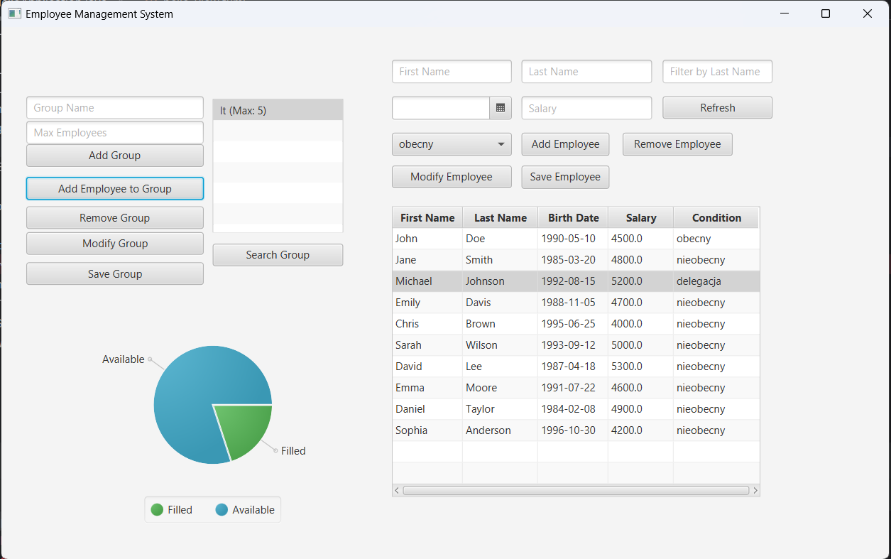

# Employee Management System 

### Project Description 
The Employee Management System is an application designed for managing employees, written in JavaFX and connected to a database. 
It allows users to add, edit, delete, and search for employees, as well as organize them into groups. 

### Technologies 
- Java (JavaFX for the user interface)
- SQL (database for storing employee information)
- JDBC (for connecting the application to the database)

